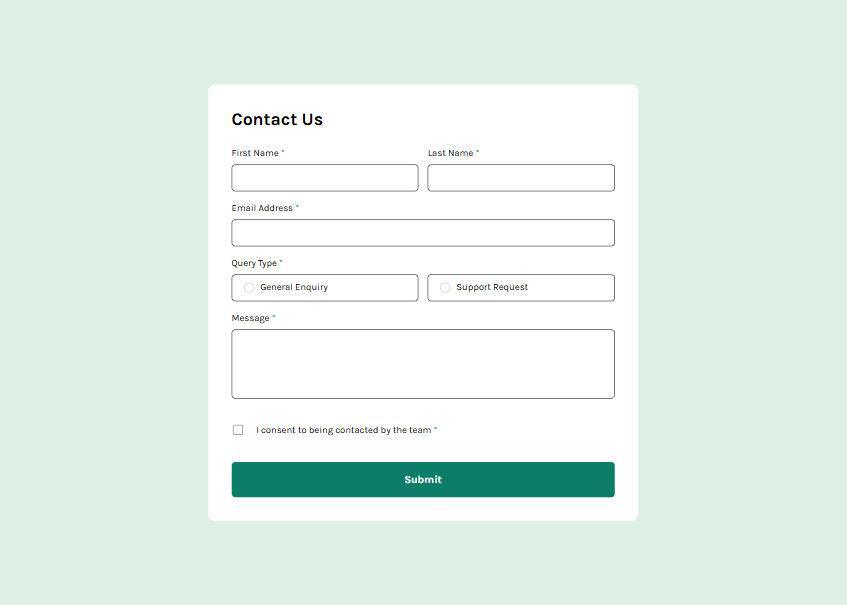

# Frontend Mentor - Contact form solution

This is a solution to the [Contact form challenge on Frontend Mentor](https://www.frontendmentor.io/challenges/contact-form--G-hYlqKJj). Frontend Mentor challenges help you improve your coding skills by building realistic projects.

## Table of contents

- [Overview](#overview)
  - [The challenge](#the-challenge)
  - [Screenshot](#screenshot)
  - [Links](#links)
- [My process](#my-process)
  - [Built with](#built-with)
  - [What I learned](#what-i-learned)
  - [Useful resources](#useful-resources)
- [Author](#author)

## Overview

### The challenge

Users should be able to:

- Complete the form and see a success toast message upon successful submission
- Receive form validation messages if:
  - A required field has been missed
  - The email address is not formatted correctly
- Complete the form only using their keyboard
- Have inputs, error messages, and the success message announced on their screen reader
- View the optimal layout for the interface depending on their device's screen size
- See hover and focus states for all interactive elements on the page

### Screenshot

### Links

- Solution URL: 
- Live Site URL: [https://fadymas.github.io/contact-form-main/](https://fadymas.github.io/contact-form-main/)

## My process

### Built with

- Semantic HTML5 markup
- ARIA Accessible
- CSS custom properties
- Flexbox
- Mobile-first workflow
- [Tailwind](https://tailwindcss.com/) - Css library
- [just-valid](https://github.com/just-valid/just-valid) - Lightweight JavaScript form validation library

### What I learned

I learned how to build responsive layouts that adapt to different screen sizes, implement accessible form validation, and enhance user experience with keyboard navigation and screen reader support. I also gained experience using Tailwind CSS for styling and just-valid for lightweight form validation.

### Useful resources

- [Tailwind CSS Documentation](https://tailwindcss.com/docs) – Helped me understand how to use responsive utility classes and how to apply spacing, typography, and custom colors effectively.

- [just-valid Documentation](https://just-validate.dev/docs/intro) – It offers comprehensive guides, API references, and practical examples for integrating form validation, customizing validation rules, and managing error messages in web forms.

## Author

- Frontend Mentor - [@fadymas](https://www.frontendmentor.io/profile/fadymas)

- LinkedIn - [@fady-mahros](www.linkedin.com/in/fady-mahrous)

- X Twitter - [@FadyMahrous](https://x.com/fadymahros941);
